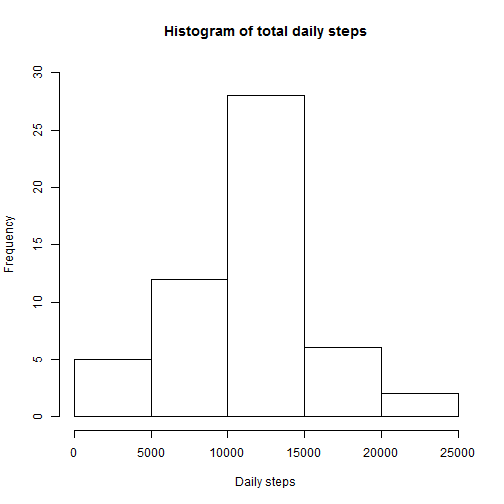

# Reproducible Research: Peer Assessment 1


## Loading and preprocessing the data
The data is loaded into a data frame from the CSV file. For the purpose of this assessment we assume that the CSV file is present in the user's working directory.

```r
data <- read.csv("activity.csv")
head(data)
```

```
##   steps       date interval
## 1    NA 2012-10-01        0
## 2    NA 2012-10-01        5
## 3    NA 2012-10-01       10
## 4    NA 2012-10-01       15
## 5    NA 2012-10-01       20
## 6    NA 2012-10-01       25
```

As instructed, we initially restrict the data by removing any records with missing step values (coded as NA).

```r
steps <- data[!(is.na(data$steps)), ]
head(steps)
```

```
##     steps       date interval
## 289     0 2012-10-02        0
## 290     0 2012-10-02        5
## 291     0 2012-10-02       10
## 292     0 2012-10-02       15
## 293     0 2012-10-02       20
## 294     0 2012-10-02       25
```


## What is mean total number of steps taken per day?
We aggregate the data to first calculate the total number of steps taken each day.

```r
step_agg <- tapply(steps$steps, steps$date, sum)
head(step_agg)
```

```
## 2012-10-01 2012-10-02 2012-10-03 2012-10-04 2012-10-05 2012-10-06 
##         NA        126      11352      12116      13294      15420
```

and as requested display this as a histogram:

```r
barplot(step_agg, names = format(as.Date(names(step_agg)), "%d"), ylab = "Total steps", 
    xlab = "Oct-Nov 2012", cex.names = 0.5)
```

 

The data in question covers a two month period, October and November 2012. The histogram shows the total number of steps taken each day. The x-axis is labelled with the day of the month in question, starting from 01 October and running through to 30 November.

We note that there are some days without data - these correspond to missing step data removed in the pre-processing.

We can calculate the mean and median total number of steps via
Mean:

```r
mean(step_agg, na.rm = TRUE)
```

```
## [1] 10766
```

and median:

```r
median(step_agg, na.rm = TRUE)
```

```
## [1] 10765
```


## What is the average daily activity pattern?
We now look at how number of steps vary across days by aggregating the data each intervals. More precisely, we calculate the average number of steps in each time interval, and plot them:

```r
interval_agg <- tapply(steps$steps, steps$interval, mean)
plot(interval_agg, type = "l", xlab = "Interval number", ylab = "Average steps")
```

 

Each interval corresponds to a five minute time period. Hence there are 12*24=288 intervals in each day. These correspond to the x-axis labels. We can see the graph peaks at about interval 100 and we can find precise information about this value, as requested via:

```r
interval_agg[interval_agg == max(interval_agg)]
```

```
##   835 
## 206.2
```

We can see that the maximum number of steps on average in any one interval is just over 200 and occurs in the five minute interval between 8:35 and 8:40, which seems reasonable.


## Imputing missing values
We can see how many missing data steps are present by querying the original dataset:

```r
sum(is.na(data$steps))
```

```
## [1] 2304
```

We will replace the missing values by the average value for the interval to which it corresponds. This seems a sensible approach compared to say, replacing with a daily mean, due to the variability of the number of steps across a day. It will also cope better with those days where we have no data at all.
We first do some pre-processing on the data containing the interval means to get it into a useful format:

```r
mean_values <- as.data.frame(interval_agg)
mean_values[, 2] = rownames(mean_values)
colnames(mean_values) = c("steps_mean", "interval")
```

and then join to the original data, replacing any missing step values (indicated by NAs) with mean value for the corresponding interval:

```r
merged_data <- merge(x = data, y = mean_values, by = "interval", all.x = TRUE)
head(merged_data)
```

```
##   interval steps       date steps_mean
## 1        0    NA 2012-10-01      1.717
## 2        0     0 2012-11-23      1.717
## 3        0     0 2012-10-28      1.717
## 4        0     0 2012-11-06      1.717
## 5        0     0 2012-11-24      1.717
## 6        0     0 2012-11-15      1.717
```

```r
merged_data[is.na(merged_data$steps), ]$steps <- merged_data[is.na(merged_data$steps), 
    ]$steps_mean
head(merged_data)
```

```
##   interval steps       date steps_mean
## 1        0 1.717 2012-10-01      1.717
## 2        0 0.000 2012-11-23      1.717
## 3        0 0.000 2012-10-28      1.717
## 4        0 0.000 2012-11-06      1.717
## 5        0 0.000 2012-11-24      1.717
## 6        0 0.000 2012-11-15      1.717
```

We can then repeat the previous analysis, producing a histogram of the total number of steps taken each day:

```r
merged_step_agg <- tapply(merged_data$steps, merged_data$date, sum)
barplot(merged_step_agg, names = format(as.Date(names(merged_step_agg)), "%d"), 
    ylab = "Total steps", xlab = "Oct-Nov 2012", cex.names = 0.5)
```

 

and computing the mean and median number of steps taken each day.

```r
mean(merged_step_agg)
```

```
## [1] 10766
```

```r
median(merged_step_agg)
```

```
## [1] 10766
```

We note that the histogram now shows data for days that originally had missing data. The mean value have remained the same. This is because the missing data actually corresponded to whole days so replacing this data with the average number of steps in each interval just contributed extra days where the total number of steps were identical to the previously calculated average, hence leaving it unchanged.

We can see a difference, for example, if we look at the total number of steps for the two cases.

```r
sum(merged_step_agg)
```

```
## [1] 656738
```

```r
sum(step_agg, na.rm = TRUE)
```

```
## [1] 570608
```


## Are there differences in activity patterns between weekdays and weekends?
To establish whether there are different activity patterns between weekdays and weekends we create a new factor variable to distinguish between the two. We add an extra column to the dataset with imputed missing values to hold this factor.

```r
merged_data$factor <- ifelse(weekdays(as.Date(merged_data$date)) == "Saturday" | 
    weekdays(as.Date(merged_data$date)) == "Sunday", "weekend", "weekday")
head(merged_data)
```

```
##   interval steps       date steps_mean  factor
## 1        0 1.717 2012-10-01      1.717 weekday
## 2        0 0.000 2012-11-23      1.717 weekday
## 3        0 0.000 2012-10-28      1.717 weekend
## 4        0 0.000 2012-11-06      1.717 weekday
## 5        0 0.000 2012-11-24      1.717 weekend
## 6        0 0.000 2012-11-15      1.717 weekday
```

We can then summarise the data by averaging over each interval as before for both weekend and weekday days:

```r
dayofweek <- tapply(merged_data$steps, list(merged_data$interval, merged_data$factor), 
    mean)
dayofweek <- as.data.frame(dayofweek)
dayofweek$interval = rownames(dayofweek)
head(dayofweek)
```

```
##    weekday  weekend interval
## 0  2.25115 0.214623        0
## 5  0.44528 0.042453        5
## 10 0.17317 0.016509       10
## 15 0.19790 0.018868       15
## 20 0.09895 0.009434       20
## 25 1.59036 3.511792       25
```

and plot using the base plotting system, mimicing the style of the example graph:

```r
par(mfrow = c(2, 1))
par(mar = c(1, 0, 0, 0), oma = c(3, 3, 3, 3))
par(mgp = c(2, 0.6, 0))
plot(dayofweek$interval, dayofweek$weekend, type = "l", axes = FALSE)
axis(4, cex.axis = 0.5)
box()
mtext("Weekend", side = 3, cex = 0.6)
plot(dayofweek$interval, dayofweek$weekday, type = "l", axes = TRUE, cex.axis = 0.5)
box()
mtext("Weekday", side = 3, cex = 0.6)
mtext("Interval", side = 1, cex = 0.7, outer = TRUE)
mtext("Average steps", side = 2, cex = 0.7, outer = TRUE)
```

 

Again, the results are not unexpected. Weekdays show a peak around "rush hour" then less activity as presumably people are sitting working, with smaller peaks around lunchtime, school finish time and the end of the working day; weekends show bursts of activity throughout daytime hours.

